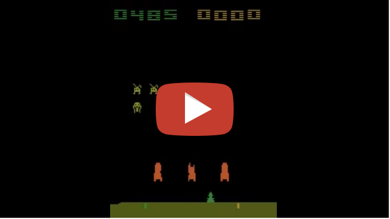

# Asynchronous Deep Reinforcement Learning
**[> Intuition, implementation description and training results can be found here <](https://dbobrenko.github.io/2016/11/03/async-deeprl.html)**

An attempt to implement asynchronous one-step Q-Learning from Google DeepMind's paper ["Asynchronous Methods for Deep Reinforcement Learning", Mnih et al., 2016.](https://arxiv.org/abs/1602.01783)


[](https://youtu.be/rz2qWeMaqtw)


Benchmarks for current implementation of Asynchronous one-step Q-Learning:

| **Device**                                          | **Input shape** | **FPS** (skipped frames was not counted)  |
|:----------------------------------------------------|:---------------:|:-----------------------------------------:|
| GPU **GTX 980 Ti**                                  | 84x84x4         | **530**                                   |
| CPU **Core i7-3770 @ 3.40GHz (4 cores, 8 threads)** | 84x84x4         | **300**                                   |

# Requirements
1. Linux based OS or Mac OS X;
2. [Anaconda package](https://www.continuum.io/downloads) (recommended);

   **OR** manually install python (both 2.7+ and 3.5+ versions are supported), and run in terminal:
   ```
   pip install six
   pip install future
   pip install scipy
   ```
3. [TensorFlow](https://www.tensorflow.org/);
4. [OpenAI Gym](https://gym.openai.com/).

# Usage
**To train** your own model on 'Atari 2600 SpaceInvaders', simply run:
```
python run_dqn.py
```

To specify another environment, use `--env` flag, e.g:
```
python run_dqn.py --env Pong-v0
```

All available environments you can check [here](https://gym.openai.com/envs). 
Note, that current implementation supports environments only with raw pixels observations.
Tested OpenAI Gym environments:
* SpaceInvaders-v0
* Pong-v0

**To change amount of spawned threads**, use `--threads` flag (by default = 8).  

**To use GPU** instead of cpu, pass `--gpu` flag.  

All available flags can be checked by: `python run_dqn.py --help`

To read TensorBoard logs, use:
`tensorboard --logdir=path/to/logdir`

# Trained models

To use pretrained agent, or change log folder, just use `--logdir` flag:
```
python run_dqn.py --logdir path/to/checkpoint/folder/
```

**Model, trained on SpaceInvaders,** over 80 millions of frames, can be downloaded from [here](https://drive.google.com/file/d/0By6rAKVSThTxRGYwRWlfM09MZTg/view).

# Evaluation
To evaluate trained agent, use:
```
python run_dqn.py --eval --eval_dir folder/for/evaluation/write --logdir path/to/checkpoint/folder/
```
